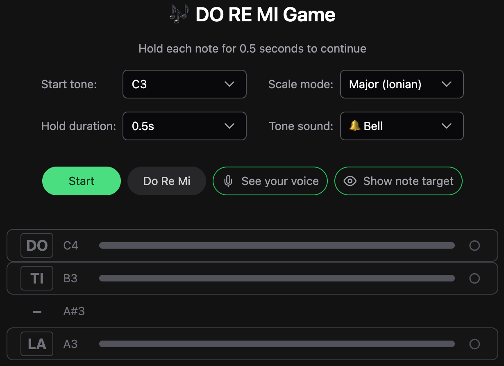
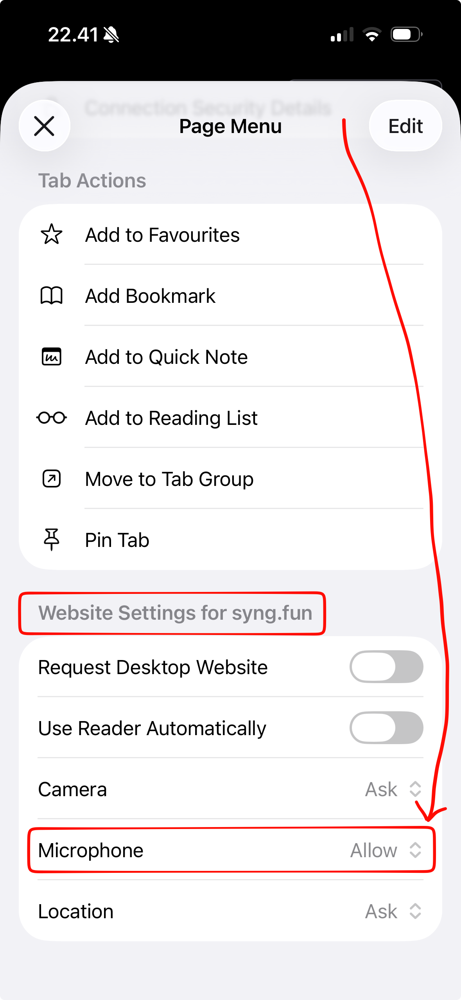
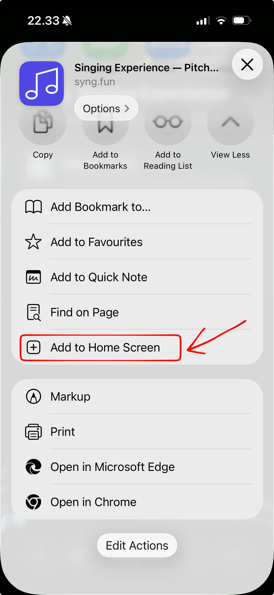

# <picture><source media="(prefers-color-scheme: dark)" srcset="public/icons/note-inverted.svg"></picture> Singing Experience

[](LICENSE)
[](https://www.syng.fun/)
[](#-offline--installable)

**Real-time vocal pitch detector and singing game — practice singing, train your ear, detect notes and frequencies, all in the browser. Free, private, works offline.**

A fun, browser-based singing practice app. Use your microphone to see what note you're singing in real time — or play a game where you sing through the musical scale.

## What Is This?

Singing Experience is a small web app that listens to your voice through your device's microphone and tells you what musical note you're singing. It's designed for anyone who wants to explore their voice, warm up before singing, or just have fun with music — no musical training required.

## 🌐 Live Demo

<a href="https://www.syng.fun"></a>

- **[www.syng.fun](https://www.syng.fun)**
- **[kunukn.github.io/singing-experience](https://kunukn.github.io/singing-experience)**


The app is deployed to Vercel under a dedicated domain and updates automatically on every push to `main`.

## Features

The app is organized into two groups, both reachable from the home screen: **🎛️ Music Tools** for real-time analysis and practice, and **🕹️ Singing Games** to train your ear and voice.

### 🎛️ Music Tools

#### 🎤 Pitch Detector

Sing or hum into your microphone and instantly see:

- The **note** you're singing (like C, D, E, etc.)
- How **in-tune** you are (are you a little sharp or flat?)
- The **frequency** of your voice in real time

##### 💡 What can you use it for?

**🎙️ Singing & voice practice**

Warm up your voice and verify you're landing on target pitches. Use the voice range presets (Soprano, Alto, Tenor, Baritone, Bass, and more) to focus the display on your register. The cents deviation and pitch history chart reveal whether your intonation is solid or drifting over time.

**👂 Ear training**

Sing or hum an interval, then check whether you matched the pitch you intended. The pitch history chart gives a visual trace of your pitch over time — a flat line close to zero cents means you held the note rock-steady.

**🎼 Music education**

Demonstrate acoustics live: play a note and show students its frequency in Hz and its name on the musical scale. The visual feedback makes abstract concepts like "sharp" and "flat" immediately concrete.

**🎵 Composition & transcription**

Hum a melody fragment and read off the notes one by one. Useful for sketching out ideas when you don't have an instrument to hand or can't read sheet music on the fly.

**🎸 Instrument tuning**

Play a note on any acoustic instrument — guitar, ukulele, violin, piano, flute, recorder — and the app instantly shows the note name in the pitch detector and how many cents off you are. A visual sharp/flat bar makes it easy to nudge the string or breath pressure until you land exactly on pitch. A dedicated tuner is available for guitar and ukulele.

#### 🎙️ Vocal Warm-Up

A guided pitch-sequence warm-up: sing the highlighted phrase, and each round transposes up a half step.

- Pick a voice register, the number of sequences, and the semitone step
- 20+ patterns across **Basic**, **Playful**, and **Advanced** groups (five-note major, octave arpeggio, bouncy ball, yodel, roller coaster, and more)
- Plays a reference start tone before each phrase

#### 🪕 Instrument Tuner

Pluck a string and see the note, a cents-deviation bar, and hear a chime when it's perfectly in tune.

- Built-in **Guitar** and **Ukulele** tunings, plus a **Custom** option
- Tuning presets grouped as Standard, Drop, Open, and Alternate
- Tap a string to hear its reference pitch

#### 🎹 Tone Detector

Detects multiple simultaneous tones in real time (C2–C7) — sing or play a harmony and see every note that's sounding.

- **Sensitivity** slider — pick up fewer or more tones
- **Noise gate** slider — set the minimum volume needed to register a tone

### 🕹️ Singing Games

#### 🎯 Sing Tone Game

A random tone plays — sing it back to match. Match a row of tones to win.

- Choose the number of rounds and the hold duration
- Finishes with your total time

#### 🎶 DO RE MI Game

A step-by-step singing game that walks you through the classic musical scale — DO, RE, MI, FA, SO, LA, TI, DO.

- The app shows you which note to sing next
- Hold the note steady for a few seconds to advance
- A visual indicator shows how close you are to the target note
- Complete the full scale to win 🎉
- You can choose how long you need to hold each note (1–10 seconds)
- Choose from **40+ scale modes** across 8 groups — see [Scale Modes](#-scale-modes) below

#### 👑 Grace Kelly Challenge

Sing along to MIKA's "Grace Kelly" (the TikTok harmony challenge). The game shows real sheet music with lyrics and walks you through the song across three modes.

- **Sing along** — pick a part and the app plays the melody while the sheet scrolls
- **Harmony** — toggle any of the 6 voices (Melody, Really high, High, One tone, Less low, Low) and hear them sing together
- **Sing live** — sing into the mic and watch noteheads turn green as you nail them; finish 80%+ to set off the confetti
- Choose your **start tone** (C2–C3) and **tempo** (50–150 BPM)
- Optional metronome click with count-in, and an active-bar highlight to keep your place

#### 🐦 Singfly

Sing to fly the bird through the gaps — your pitch controls how high it flies.

- Game length from 5 to 60 seconds
- Difficulty: Easy, Normal, or Hard

#### 🎼 Pitch Game

Target notes scroll in — sing each one and hold it to score. Race the clock and hit as many as you can.

- Game length: 5, 10, 20, or 30 seconds
- Adjustable hold duration per note

### 🎼 Scale Modes

The DO RE MI Game supports 40+ scale modes spanning classical, jazz, world, and more. Pick any mode and the game maps its intervals to the DO RE MI syllables so you can sing and hear how each scale sounds.

| Group              | Count | Modes                                                                                                                                         |
| ------------------ | ----- | --------------------------------------------------------------------------------------------------------------------------------------------- |
| Church Modes       | 7     | Major (Ionian), Dorian, Phrygian, Lydian, Mixolydian, Minor (Aeolian), Locrian                                                                |
| Melodic Minor      | 7     | Melodic Minor, Dorian ♭2, Lydian Augmented, Lydian Dominant, Mixolydian ♭6, Locrian ♮2, Altered Scale                                         |
| Harmonic Minor     | 7     | Harmonic Minor, Locrian ♮6, Ionian ♯5, Ukrainian Dorian, Phrygian Dominant, Lydian ♯2, Super Locrian ♭♭7                                      |
| Harmonic Major     | 7     | Harmonic Major, Dorian ♭5, Phrygian ♭4, Lydian ♭3, Mixolydian ♭2, Lydian Augmented ♯2, Locrian ♭♭7                                            |
| World / Ethnic     | 8     | Double Harmonic (Byzantine), Hungarian Minor, Hungarian Major, Neapolitan Minor, Neapolitan Major, Persian, Major Locrian, Leading Whole Tone |
| Jazz / Bebop       | 3     | Major Bebop, Dominant Bebop, Minor Bebop                                                                                                      |
| Blues & Pentatonic | 4     | Minor Pentatonic, Major Pentatonic, Minor Blues, Major Blues                                                                                  |
| Symmetric          | 4     | Whole Tone, Diminished (Half-Whole), Diminished (Whole-Half), Augmented                                                                       |

### 📲 Offline & Installable

The app works fully offline after the first visit — all assets are cached by a service worker.

- **No internet required** after the initial load
- **Install it** like a native app: use "Add to Home Screen" on mobile or your browser's install option on desktop
- Updates are applied automatically in the background when a new version is available

### 🌍 Multiple Languages

The app is available in 15 languages, covering roughly 68% of the world's population:

|     | Language                  | Code |
| --- | ------------------------- | ---- |
| 🇬🇧  | English                   | en   |
| 🇨🇳  | 中文 (Chinese)            | zh   |
| 🇪🇸  | Español (Spanish)         | es   |
| 🇮🇳  | हिन्दी (Hindi)            | hi   |
| 🇸🇦  | العربية (Arabic)          | ar   |
| 🇧🇩  | বাংলা (Bengali)           | bn   |
| 🇧🇷  | Português (Portuguese)    | pt   |
| 🇷🇺  | Русский (Russian)         | ru   |
| 🇯🇵  | 日本語 (Japanese)         | ja   |
| 🇫🇷  | Français (French)         | fr   |
| 🇩🇪  | Deutsch (German)          | de   |
| 🇮🇩  | Bahasa Indonesia          | id   |
| 🇹🇿  | Kiswahili (Swahili)       | sw   |
| 🇩🇰  | Dansk (Danish)            | da   |
| 🇬🇱  | Kalaallisut (Greenlandic) | kl   |

Locale files are lazy-loaded — only the selected language is fetched. To add a new language, create a JSON file in `src/locales/` and add an entry to the `languages` array in `src/components/generic/LanguageSwitcher.vue`.

## 🔒 Your Privacy

**Everything happens on your device.** This is a static app — there is no server and no backend.

- Your microphone audio is **never recorded**
- Your voice data is **never sent anywhere**
- No data leaves your browser — everything runs 100% locally on your device
- The app simply analyzes your voice in real time and shows you the result on screen

You will be asked to allow microphone access when you start a program. This is a standard browser permission — the app needs it to hear your voice. You can revoke this permission at any time in your browser settings.

## Getting Started

To run the app on your own computer, you need [Node.js](https://nodejs.org/) installed (version 24 or later is recommended).

1. **Download or clone the project**

   ```sh
   git clone https://github.com/kunukn/singing-experience.git
   cd singing-experience
   ```

2. **Install dependencies**

   ```sh
   npm install
   ```

3. **Start the app**

   ```sh
   npm run dev
   ```

4. **Open your browser** and go to the address shown in the terminal (usually `http://localhost:5555`)

That's it! The app runs entirely in your browser.

> Contributing? See [CONTRIBUTING.md](CONTRIBUTING.md) for the full list of npm scripts and the script naming convention.

## 🔒 Dependency safety

The committed `.npmrc` hardens `npm install` against supply-chain attacks:

- **Public registry only** — installs are pinned to `registry.npmjs.org`.
- **2-day cooldown** — only package versions published at least 2 days ago can be
  installed (`min-release-age=2`). This dodges most freshly-published malicious
  releases before they reach your lockfile.
- **Exact versions** — newly added dependencies are pinned (`save-exact=true`).
- **Strict audits & engines** — `npm audit` fails on high/critical issues, and the
  Node 24+ / npm 11+ requirement is enforced.

**Urgent vetted patch** newer than the cooldown window? Override per command:

```sh
npm i <package> --min-release-age=0
```

This is a guardrail, not a hard lock — a CLI flag or environment variable can
still override it, so true enforcement needs a registry firewall. `npm ci`
installs the exact lockfile versions and is unaffected by the cooldown, so CI
stays deterministic.

## Troubleshooting

### 🎤 Microphone access was denied

If you accidentally blocked microphone access, the browser remembers your choice and won't ask again. The app needs microphone permission to hear your voice — without it, nothing will work.

**How to re-enable:**

- **Chrome / Edge (desktop)** — click the 🔒 lock (or tune/slider) icon in the address bar → find **Microphone** → change to **Allow** → reload the page.
- **Firefox (desktop)** — click the 🔒 lock icon → **Connection secure** → **More information** → **Permissions** tab → find **Use the Microphone** → remove the block.
- **Safari (Mac)** — Safari menu → **Settings** → **Websites** → **Microphone** → find the site and change to **Allow**.
- **Safari (iPhone / iPad)** — open **Settings** → **Safari** → **Microphone** → set to **Allow** (or **Ask**).
- **Chrome (Android)** — tap the 🔒 lock icon in the address bar → **Permissions** → **Microphone** → change to **Allow**.

### 🔐 Why does iOS keep asking for microphone permission on a specific website even though I have accepted?

iOS Safari treats web microphone permission as per-session by default, not per-site. "Accepting" only lasts until the tab/browser closes.

**On iOS, use Safari.** Only Safari exposes the per-site permission toggle below — other iOS browsers (Chrome, Firefox, Edge) all run on the same WebKit engine but hide this setting, so they keep re-asking every session.

**Two durable fixes:**

1. **Set the site's permission to Allow** (Safari only) — tap the **aA** (page settings) button in the address bar → **Website Settings** → set **Microphone** to **Allow**. You can also set the global default in **Settings → Safari → Microphone**.



2. **Install it to the Home Screen** (most reliable, works in any iOS browser) — use **Share → Add to Home Screen**, then launch the app from its home-screen icon. As an installed PWA it runs in its own permission scope, so the microphone grant persists across launches instead of resetting every session.



### 🔇 No sound on iPhone or iPad

iPhones and iPads have a **silent mode switch**. When silent mode is on, the browser cannot play any audio — even if the in-app volume is fine.

**Fix:**

- **Older models** — flip the physical silent switch off (so no orange is visible).
- **Newer iPhones and iPads** — open **Control Center** and tap the **Silent Mode** button to turn it off.
- Also check that **Do Not Disturb** is off (Control Center → Focus → Do Not Disturb), as it can suppress audio too.

### 🔁 Sound stops working on iPhone or iPad

iOS Safari is strict about how web pages are allowed to use audio. After certain events, the browser may **suspend** or **interrupt** the app's audio engine, and sound stops playing — even though the buttons still respond.

Common triggers on iOS:

- Switching to another app or browser tab
- Locking the screen or letting it auto-lock
- Receiving a phone call, FaceTime, or activating Siri
- Connecting or disconnecting AirPods, Bluetooth headphones, or a speaker
- Long periods of inactivity in the tab

The app tries to recover automatically the next time you tap a button, but iOS does not always allow it.

**Reliable fix:** **reload the page**. This creates a fresh audio engine, which iOS lets the app use again on your next tap.

**To reduce the chance it happens:**

- Keep the Singing Experience tab in the foreground while you play
- Avoid switching to other audio apps (music, video) mid-session
- Plug in or pair your headphones **before** starting a session, not during

### 🔈 No sound on Android or other tablets

- Make sure your device **volume is turned up** — use the physical volume buttons.
- Check that **Do Not Disturb** mode is off (it can suppress audio on some devices).
- If you're connected to **Bluetooth headphones or a speaker**, audio may be routed there instead of the device speaker.

### 🎧 Audio plays through the wrong output

If audio seems to play but you can't hear it, your device may be routing sound to a Bluetooth device, HDMI display, or AirPlay receiver. Disconnect external audio devices or switch the output in your device's audio settings.

## License

This project is open source under the [0BSD License](LICENSE). _do what you want, but don't blame me._
